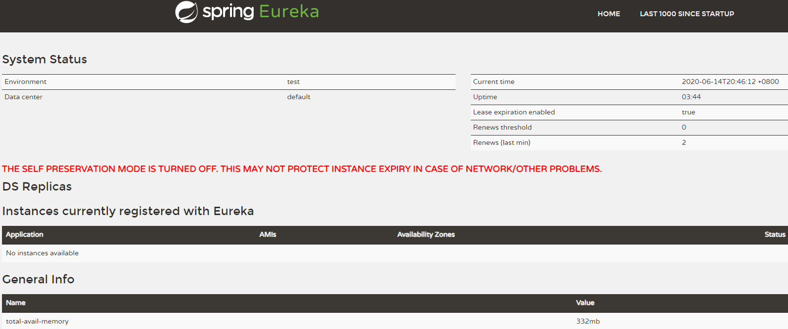
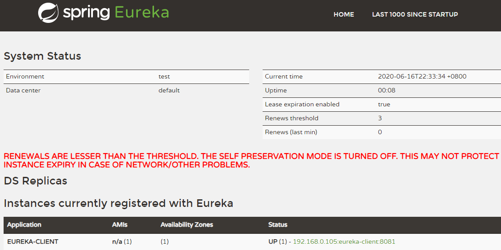

# Eureka入门实例

[toc]


## 推荐阅读

> - [SpringCloud之Eureka](https://juejin.im/post/5ca4ca43e51d4577dd2e82e3)
> - [Spring Cloud Eureka：服务注册与发现](https://juejin.im/post/5d78cd53f265da03d55e8351)
> - 


## 概述

Netflix Eureka 是由Netflix 开源的一款基于 REST 的服务发现组件，包括Eureka Server 及 Eureka Client。2.x 版本已停止维护，目前主要是以1.x版本为主。


P2P的复制模式：

> Eureka Server 端采用的是 **P2P的复制模式**，但是它不保证复制操作一定能成功，因此它提供的是一个最终一致性的服务实例视图；

服务租约与定时剔除：

> Client 端在Server端 的注册信息有一个带期限的租约，一旦Server 端在指定期间没有收到Client 端发送的心跳，则Server端会认为Client端注册的服务是不健康的，定时任务会将其从注册表中删除。


## 一、Eureka 注册中心（单机版）

### 1.父工程Pom.xml

```xml
<?xml version="1.0" encoding="UTF-8"?>
<project xmlns="http://maven.apache.org/POM/4.0.0"
         xmlns:xsi="http://www.w3.org/2001/XMLSchema-instance"
         xsi:schemaLocation="http://maven.apache.org/POM/4.0.0 http://maven.apache.org/xsd/maven-4.0.0.xsd">
    <parent>
        <artifactId>sample-discovery</artifactId>
        <groupId>com.ray.study.sample</groupId>
        <version>1.0-SNAPSHOT</version>
    </parent>
    <modelVersion>4.0.0</modelVersion>

    <artifactId>sample-discovery-eureka</artifactId>
    <packaging>pom</packaging>

    <modules>
        <module>eureka-server</module>
        <module>eureka-client</module>
    </modules>

    <properties>
        <project.build.sourceEncoding>UTF-8</project.build.sourceEncoding>
        <project.reporting.outputEncoding>UTF-8</project.reporting.outputEncoding>
        <java.version>1.8</java.version>
        <maven.compiler.source>${java.version}</maven.compiler.source>
        <maven.compiler.target>${java.version}</maven.compiler.target>
        <spring-cloud.version>Hoxton.SR5</spring-cloud.version>
    </properties>

    <dependencies>
        <dependency>
            <groupId>org.springframework.boot</groupId>
            <artifactId>spring-boot-starter-test</artifactId>
            <scope>test</scope>
        </dependency>
    </dependencies>

    <dependencyManagement>
        <dependencies>
            <dependency>
                <groupId>org.springframework.cloud</groupId>
                <artifactId>spring-cloud-dependencies</artifactId>
                <version>${spring-cloud.version}</version>
                <type>pom</type>
                <scope>import</scope>
            </dependency>
        </dependencies>
    </dependencyManagement>

</project>
```


### 2.Eureka 注册中心

#### 2.1 添加依赖

```xml
<?xml version="1.0" encoding="UTF-8"?>
<project xmlns="http://maven.apache.org/POM/4.0.0"
         xmlns:xsi="http://www.w3.org/2001/XMLSchema-instance"
         xsi:schemaLocation="http://maven.apache.org/POM/4.0.0 http://maven.apache.org/xsd/maven-4.0.0.xsd">
    <parent>
        <artifactId>sample-discovery-eureka</artifactId>
        <groupId>com.ray.study.sample</groupId>
        <version>1.0-SNAPSHOT</version>
    </parent>
    <modelVersion>4.0.0</modelVersion>

    <artifactId>eureka-server</artifactId>

    <dependencies>
        <dependency>
            <groupId>org.springframework.cloud</groupId>
            <artifactId>spring-cloud-starter-netflix-eureka-server</artifactId>
        </dependency>
    </dependencies>
    
</project>
```


#### 2.2 启动类

在启动类上添加`@EnableEurekaServer`注解即可启用 eureka 注册中心

```java
@EnableEurekaServer
@SpringBootApplication
public class EurekaServerApplication {

    public static void main(String[] args) {
        SpringApplication.run(EurekaServerApplication.class, args);
    }

}

```


#### 2.3 application.yml

```yml
server:
  port: 8761
spring:
  application:
    name: eurka-server   #指定服务名
eureka:
  instance:
    hostname: localhost
  server:
    enable-self-preservation: false         #是否开启自我保护模式
    wait-time-in-ms-when-sync-empty: 60000  #服务注册表清理间隔（单位毫秒，默认是60*1000）
  client:
    register-with-eureka: false  #服务注册，是否将自己注册到Eureka服务注册中心，单机版本时，为false就好
    fetch-registry: false        #服务发现，是否从Eureka中获取注册信息
    # Eureka客户端与Eureka服务端的交互地址，高可用状态配置对方的地址，单机状态配置自己（如果不配置则默认本机8761端口）
    service-url:
      defaultZone: http://${eureka.instance.hostname}:${server.port}/eureka/
```


> - 更多的可配置选项，请查看`spring-cloud-starter-netflix-eureka-server`以及`spring-cloud-starter-netflix-eureka-client`工程下的`spring-configuration-metadata.json`文件，在这个json文件中，我们可以看到有哪些可选配置项，配置项的描述，以及配置项是对应那个Java类的哪个属性
> - 相关配置属性类为：EurekaInstanceConfigBean、EurekaServerConfigBean、EurekaClientConfigBean


#### 2.4 启动注册中心

此时启动`EurekaServerApplication` ，然后浏览器访问 http://localhost:8761/




### 3.Eureka 客户端

#### 3.1 添加依赖

```xml
<?xml version="1.0" encoding="UTF-8"?>
<project xmlns="http://maven.apache.org/POM/4.0.0"
         xmlns:xsi="http://www.w3.org/2001/XMLSchema-instance"
         xsi:schemaLocation="http://maven.apache.org/POM/4.0.0 http://maven.apache.org/xsd/maven-4.0.0.xsd">
    <parent>
        <artifactId>sample-discovery-eureka</artifactId>
        <groupId>com.ray.study.sample</groupId>
        <version>1.0-SNAPSHOT</version>
    </parent>
    <modelVersion>4.0.0</modelVersion>

    <artifactId>eureka-client</artifactId>

    <dependencies>
        <dependency>
            <groupId>org.springframework.boot</groupId>
            <artifactId>spring-boot-starter-web</artifactId>
        </dependency>
        <dependency>
            <groupId>org.springframework.cloud</groupId>
            <artifactId>spring-cloud-starter-netflix-eureka-client</artifactId>
        </dependency>
    </dependencies>

</project>
```


#### 3.2 启动类

在启动类上添加`@EnableDiscoveryClient`注解即可启用 eureka client 服务发现

```java
@EnableDiscoveryClient
@SpringBootApplication
public class EurekaClientApplication {

    public static void main(String[] args) {
        SpringApplication.run(EurekaClientApplication.class, args);
    }

}

```


#### 3.3 application.yml

```yml
server:
  port: 8081 #运行端口号
spring:
  application:
    name: eureka-client #指定服务名
eureka:
  client:
    register-with-eureka: true #注册到Eureka的注册中心
    fetch-registry: true #获取注册实例列表
    service-url:
      defaultZone: http://localhost:8761/eureka/ #指定注册中心地址
```


#### 3.4 启动 Eureka 客户端

此时启动`EurekaClientApplication` ，然后浏览器访问 http://localhost:8761/ ， 发现Eureka客户端已注册到注册中心




