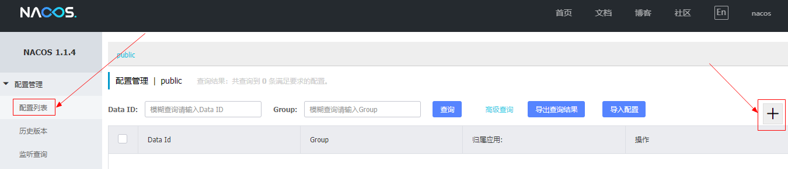

# Nacos 入门实例

[toc]

## 官方文档

> - [Nacos 文档](https://nacos.io/zh-cn/docs/quick-start-spring-cloud.html)


## 推荐阅读

> - [Nacos 快速开始](https://nacos.io/zh-cn/docs/quick-start.html)
> - [nacos-group/nacos-examples](https://github.com/nacos-group/nacos-examples)
> - [Nacos 中文文档](https://www.bookstack.cn/books/Nacos)


## 前言

nacos，一个更易于构建云原生应用的动态**服务发现**、**配置管理**和服务管理平台。


# 一、Nacos 快速开始

### 1.启动 Nacos Server


#### 1.1 预备环境准备

Nacos 依赖 [Java](https://docs.oracle.com/cd/E19182-01/820-7851/inst_cli_jdk_javahome_t/) 环境来运行。如果您是从代码开始构建并运行Nacos，还需要为此配置 [Maven](https://maven.apache.org/index.html)环境，请确保是在以下版本环境中安装使用:

> 1. 64 bit OS，支持 Linux/Unix/Mac/Windows，推荐选用 Linux/Unix/Mac。
> 2. 64 bit JDK 1.8+；[下载](http://www.oracle.com/technetwork/java/javase/downloads/jdk8-downloads-2133151.html) & [配置](https://docs.oracle.com/cd/E19182-01/820-7851/inst_cli_jdk_javahome_t/)。
> 3. Maven 3.2.x+；[下载](https://maven.apache.org/download.cgi) & [配置](https://maven.apache.org/settings.html)。


#### 1.2 下载源码并安装

```bash
# 克隆源码
git clone https://github.com/alibaba/nacos.git --depth=1

# 进入nacos主目录
cd nacos/

# 编译打包安装 ancos
mvn -Prelease-nacos -Dmaven.test.skip=true clean install  -U  

```


#### 1.3 启动 Nacos Server

```bash
# 进入bin目录
cd distribution/target/nacos-server-$version/nacos/bin

# Linux/Unix/Mac： 单机启动 nacos 
sh startup.sh -m standalone

# Windows 
cmd startup.cmd
```


然后浏览器访问 http://localhost:8848/nacos ，用户名密码：`nacos/nacos`


### 2.Nacos 注册中心


#### 2.1 服务提供者

##### 2.1.1 添加依赖

项目依赖：

```xml
<?xml version="1.0" encoding="UTF-8"?>
<project xmlns="http://maven.apache.org/POM/4.0.0"
         xmlns:xsi="http://www.w3.org/2001/XMLSchema-instance"
         xsi:schemaLocation="http://maven.apache.org/POM/4.0.0 http://maven.apache.org/xsd/maven-4.0.0.xsd">
    <parent>
        <artifactId>sample-discovery-nacos</artifactId>
        <groupId>com.ray.study.sample</groupId>
        <version>1.0-SNAPSHOT</version>
    </parent>
    <modelVersion>4.0.0</modelVersion>

    <artifactId>nacos-provider</artifactId>

    <properties>
        <project.build.sourceEncoding>UTF-8</project.build.sourceEncoding>
        <project.reporting.outputEncoding>UTF-8</project.reporting.outputEncoding>
        <java.version>1.8</java.version>
        <maven.compiler.source>${java.version}</maven.compiler.source>
        <maven.compiler.target>${java.version}</maven.compiler.target>
        <spring-cloud-alibaba.version>2.2.1.RELEASE</spring-cloud-alibaba.version>
    </properties>

    <dependencies>
        <dependency>
            <groupId>org.springframework.boot</groupId>
            <artifactId>spring-boot-starter-web</artifactId>
        </dependency>
        <!-- nacos-discovery -->
        <dependency>
            <groupId>com.alibaba.cloud</groupId>
            <artifactId>spring-cloud-starter-alibaba-nacos-discovery</artifactId>
        </dependency>
    </dependencies>
    
    <dependencyManagement>
        <dependencies>
            <dependency>
                <groupId>com.alibaba.cloud</groupId>
                <artifactId>spring-cloud-alibaba-dependencies</artifactId>
                <version>${spring-cloud-alibaba.version}</version>
                <type>pom</type>
                <scope>import</scope>
            </dependency>
        </dependencies>
    </dependencyManagement>

</project>
```


##### 2.1.2 启动类

```java
@SpringBootApplication
@EnableDiscoveryClient
public class ProviderApplication {

    public static void main(String[] args) {
        SpringApplication.run(ProviderApplication.class, args);
    }

}
```


##### 2.1.3 `application.properties` 

```yml
server:
  port: 18081
spring:
  application:
    name: service-provider
  cloud:
    nacos:
      discovery:
        server-addr: 127.0.0.1:8848
```


##### 2.1.4 ProviderController

```java
@RestController
public class ProviderController {

    @Value("${server.port}")
    private String port;

    @GetMapping("hello")
    public String hello(){
        return "server.port: " + port;
    }

}
```


#### 2.2 服务消费者

##### 2.2.1 添加依赖

```xml
<?xml version="1.0" encoding="UTF-8"?>
<project xmlns="http://maven.apache.org/POM/4.0.0"
         xmlns:xsi="http://www.w3.org/2001/XMLSchema-instance"
         xsi:schemaLocation="http://maven.apache.org/POM/4.0.0 http://maven.apache.org/xsd/maven-4.0.0.xsd">
    <parent>
        <artifactId>sample-discovery-nacos</artifactId>
        <groupId>com.ray.study.sample</groupId>
        <version>1.0-SNAPSHOT</version>
    </parent>
    <modelVersion>4.0.0</modelVersion>

    <artifactId>nacos-consumer</artifactId>

    <properties>
        <project.build.sourceEncoding>UTF-8</project.build.sourceEncoding>
        <project.reporting.outputEncoding>UTF-8</project.reporting.outputEncoding>
        <java.version>1.8</java.version>
        <maven.compiler.source>${java.version}</maven.compiler.source>
        <maven.compiler.target>${java.version}</maven.compiler.target>
        <spring-cloud-alibaba.version>2.2.1.RELEASE</spring-cloud-alibaba.version>
    </properties>

    <dependencies>
        <dependency>
            <groupId>org.springframework.boot</groupId>
            <artifactId>spring-boot-starter-web</artifactId>
        </dependency>
        <!-- nacos-discovery -->
        <dependency>
            <groupId>com.alibaba.cloud</groupId>
            <artifactId>spring-cloud-starter-alibaba-nacos-discovery</artifactId>
        </dependency>
    </dependencies>

    <dependencyManagement>
        <dependencies>
            <dependency>
                <groupId>com.alibaba.cloud</groupId>
                <artifactId>spring-cloud-alibaba-dependencies</artifactId>
                <version>${spring-cloud-alibaba.version}</version>
                <type>pom</type>
                <scope>import</scope>
            </dependency>
        </dependencies>
    </dependencyManagement>

</project>
```


##### 2.2.2 启动类

```java
@SpringBootApplication
@EnableDiscoveryClient
public class ConsumerApplication {

    @LoadBalanced
    @Bean
    RestTemplate loadBalanced() {
        return new RestTemplate();
    }

    @Primary
    @Bean
    RestTemplate restTemplate() {
        return new RestTemplate();
    }

    public static void main(String[] args) {
        SpringApplication.run(ConsumerApplication.class,args);
    }

}

```


##### 2.2.3 `application.properties` 

```yml
server:
  port: 18081
spring:
  application:
    name: service-provider
  cloud:
    nacos:
      discovery:
        server-addr: 127.0.0.1:8848
```


##### 2.2.4 ConsumerController

```java
@RestController
public class ConsumerController {

    @Autowired
    private LoadBalancerClient loadBalancerClient;

    @Autowired
    private RestTemplate restTemplate;

    @Value("${spring.application.name}")
    private String appName;

    @GetMapping("/consume")
    public String consume(){
        //使用 LoadBalanceClient 和 RestTemolate 结合的方式来访问
        ServiceInstance serviceInstance = loadBalancerClient.choose("service-provider");
        String url = String.format("http://%s:%s/hello", serviceInstance.getHost(), serviceInstance.getPort());
        System.out.println("request url:"+url);
        return restTemplate.getForObject(url, String.class);
    }

}

```


#### 2.3 最终效果


分别启动`ProviderApplication` 、`ConsumerApplication` ，访问注册中心可以分别看到两个应用的实例


然后浏览器访问服务消费者，可以看到打印出来服务提供者的端口


### 3.配置中心

  	在系统开发过程中，通常需要将一些配置分离出来独立管理，比如环境差异性配置、动态性更新配置。

nacos作为一个统一的配置中心，具备如下功能：

> - **系统配置的集中管理**（编辑、存储、分发）
> - **动态更新不重启**
> - **回滚配置**（变更管理、历史版本管理、变更审计)


#### 3.1 nacos中创建统一配置

配置管理 -> 配置列表 -> 新建配置




