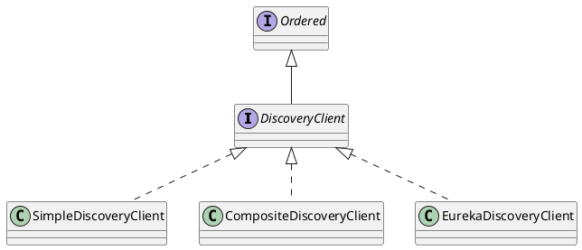

# Eureka源码解析

[toc]

## 推荐阅读

> - [Netflix/eureka](https://github.com/Netflix/eureka)
> - [深入理解Eureka之源码解析](https://blog.csdn.net/forezp/article/details/73017664)
> - [Eureka 源码分析之 Eureka Client](https://mp.weixin.qq.com/s/47TUd96NMz67_PCDyvyInQ)
> - [Eureka 源码分析之 Eureka Server](https://juejin.im/post/6844903864605343758)
> - [Spring Cloud源码分析（一）Eureka](http://blog.didispace.com/springcloud-sourcecode-eureka/)

## 一、Eureka 架构

### 1.Eureka 架构图

> [https://github.com/Netflix/eureka/wiki/Eureka-at-a-glance](https://github.com/Netflix/eureka/wiki/Eureka-at-a-glance)


### 2.相关概念

（1）Register：服务注册

> Eureka Client 启动时，会向 Eureka Server 注册服务，主要是注册自身元数据信息，例如IP地址、端口、运行状况指示符URL、主页等。

（2）Renew：服务续约

> - Eureka Client 每隔30秒会发送一次心跳来续约，通过续约来告知 Eureka Server 该 Eureka Client 可用。
>
> - 正常情况下，如果 Eureka Server 在90秒内没有收到 Eureka Client 的续约，它会将实例从其注册表中删除。 建议不要更改续约间隔。

（3）Get Registry：获取注册表

> - Eureka Client 从 Eureka Server 获取注册表信息，并将其缓存在本地，客户端会使用该信息查找其他服务，从而进行远程调用。
>
> - 该注册列表信息定期（每30秒钟）更新一次。每次返回注册列表信息可能与Eureka客户端的缓存信息不同， Eureka客户端自动处理。
>
> - 如果由于某种原因导致注册列表信息不能及时匹配，Eureka客户端则会重新获取整个注册表信息。
>
> - Eureka服务器缓存注册列表信息，整个注册表以及每个应用程序的信息进行了压缩，压缩内容和没有压缩的内容完全相同。Eureka客户端和Eureka 服务器可以使用JSON / XML格式进行通讯。在默认的情况下Eureka客户端使用压缩JSON格式来获取注册列表的信息。

（4）Cancel：服务下线

> Eureka Client 在程序关闭时向 Eureka Server 发送 Cancel 请求。 发送请求后，该客户端实例信息将从服务器的实例注册表中删除。
>
> 该下线请求不会自动完成，它需要调用以下内容：
>
> ```java
> DiscoveryManager.getInstance().shutdownComponent()；
> ```

（5）Eviction：服务剔除

> 在默认的情况下，当 Eureka Client 连续90秒没有向 Eureka Server 发送心跳，则 Eureka Server 会将该服务实例从服务注册列表删除，即服务剔除。

### 3.说明

（1）图中共有两个角色 Eureka Server和Eureka Client，同时Eureka Client又分为Applicaton Service和Application Client，即服务提供者何服务消费者。每个区域有一个Eureka集群，并且每个区域至少有一个eureka服务器可以处理区域故障，以防服务器瘫痪。

（2）Eureka Client （客户端）启动时，会向 Eureka Server （注册中心）进行注册，然后会每隔30秒向注册中心发送一次心跳来续约服务。如果注册中心在90秒内未收到 Eureka 客户端的心跳，那么 Eureka 客户端将从服务注册表中删除。服务注册信息和续约会被复制到集群中的注册中心的所有节点。来自任何区域的Eureka Client都可以查找注册表信息（每30秒发生一次）。根据这些注册表信息，Application Client可以远程调用Applicaton Service来消费服务。

## 二、Eureka 类图




