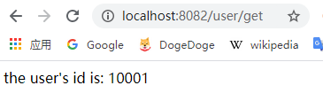

# Feign入门实例

[toc]


## 推荐阅读

> - https://cloud.spring.io/spring-cloud-static/spring-cloud-openfeign/3.0.0.M1/reference/html/
> - [springcloud Feign配置一](https://juejin.im/post/5e952ab4e51d4546e64c6fbc)
> - 


## 概述

> 在Spring Cloud 微服务中，各个服务提供者都是通过Http接口的形式对外提供服务，因此服务消费者调用服务提供者时，底层是通过 Http Client 的方式访问。
>
> 常用的 Http Client 技术有： 
>
> - JDK 原生的 URLConnection
> - Apache 的 HttpClient
> - Square 的 OkHttp
> - Netty 的异步 HttpClient 等
>
> 这一节使用的 Feign ，在底层就是使用如上的HttpClient技术进行服务间Http调用的。


Spring Cloud Feign  是一种声明式、模板化的 HTTP 客户端，它使得编写 Web Service 客户端变得更加简单，我们只需要**通过创建接口并用注解来配置它既可完成对 Web 服务接口的绑定**。它具有如下特性：

> - 可插拔的注解支持，包括 Feign 注解、JAX-RS 注解
> - 支持可插拔的HTTP编码器和解码器
> - 支持 Hystrix 和它的 Fallback
> - 支持Ribbon的负载均衡
> - 支持Http请求和响应的压缩


## 一、Feign入门实例

### 1.父工程Pom.xml

```xml
<?xml version="1.0" encoding="UTF-8"?>
<project xmlns="http://maven.apache.org/POM/4.0.0"
         xmlns:xsi="http://www.w3.org/2001/XMLSchema-instance"
         xsi:schemaLocation="http://maven.apache.org/POM/4.0.0 http://maven.apache.org/xsd/maven-4.0.0.xsd">
    <parent>
        <artifactId>spring-cloud-sample</artifactId>
        <groupId>com.ray.study.sample</groupId>
        <version>1.0-SNAPSHOT</version>
    </parent>
    <modelVersion>4.0.0</modelVersion>

    <artifactId>sample-feign</artifactId>
    <packaging>pom</packaging>
    <modules>
        <module>sample-consumer-openfeign</module>
    </modules>

    <properties>
        <project.build.sourceEncoding>UTF-8</project.build.sourceEncoding>
        <project.reporting.outputEncoding>UTF-8</project.reporting.outputEncoding>
        <java.version>1.8</java.version>
        <maven.compiler.source>${java.version}</maven.compiler.source>
        <maven.compiler.target>${java.version}</maven.compiler.target>
        <spring-cloud.version>Hoxton.SR5</spring-cloud.version>
    </properties>

    <dependencies>
        <dependency>
            <groupId>org.projectlombok</groupId>
            <artifactId>lombok</artifactId>
            <optional>true</optional>
        </dependency>
    </dependencies>

    <dependencyManagement>
        <dependencies>
            <dependency>
                <groupId>org.springframework.cloud</groupId>
                <artifactId>spring-cloud-dependencies</artifactId>
                <version>${spring-cloud.version}</version>
                <type>pom</type>
                <scope>import</scope>
            </dependency>
        </dependencies>
    </dependencyManagement>

</project>
```


### 2.引入依赖

```xml
<?xml version="1.0" encoding="UTF-8"?>
<project xmlns="http://maven.apache.org/POM/4.0.0"
         xmlns:xsi="http://www.w3.org/2001/XMLSchema-instance"
         xsi:schemaLocation="http://maven.apache.org/POM/4.0.0 http://maven.apache.org/xsd/maven-4.0.0.xsd">
    <parent>
        <artifactId>sample-feign</artifactId>
        <groupId>com.ray.study.sample</groupId>
        <version>1.0-SNAPSHOT</version>
    </parent>
    <modelVersion>4.0.0</modelVersion>

    <artifactId>sample-consumer-feign</artifactId>

    <dependencies>

        <dependency>
            <groupId>org.springframework.boot</groupId>
            <artifactId>spring-boot-starter-web</artifactId>
        </dependency>

        <!-- eureka-client -->
        <dependency>
            <groupId>org.springframework.cloud</groupId>
            <artifactId>spring-cloud-starter-netflix-eureka-client</artifactId>
        </dependency>

        <!-- openfeign -->
        <dependency>
            <groupId>org.springframework.cloud</groupId>
            <artifactId>spring-cloud-starter-openfeign</artifactId>
        </dependency>
    </dependencies>

</project>
```


### 3.修改配置

#### 3.1 启动类

在启动类上添加`@EnableFeignClients`注解即可启用 Feign

```java
@EnableFeignClients
@EnableDiscoveryClient
@SpringBootApplication
public class OpenFeignApplication {

    public static void main(String[] args) {
        SpringApplication.run(OpenFeignApplication.class, args);
    }

}
```


#### 3.2  application.yml

```yml
server:
  port: 8082 #运行端口号
spring:
  application:
    name: consumer-openfeign #指定服务名

#配置eureka
eureka:
  client:
    register-with-eureka: true #注册到Eureka的注册中心
    fetch-registry: true #获取注册实例列表
    service-url:
      defaultZone: http://localhost:8761/eureka/ #指定注册中心地址

#配置feign，连接超时及读取超时配置
feign:
  client:
    config:
      default:
        connectTimeout: 5000
        readTimeout: 5000
        loggerLevel: basic
```


### 4.声明 FeignClient

在 [SpringCloud_Discovery_01_Eureka入门实例](../../sample-discovery/doc/SpringCloud_Discovery_01_Eureka入门实例.md) 这一节中， 在 eureka-client 服务下，我们有一个UserController 

```java
@RestController
@RequestMapping("/user")
public class UserController {

    /**
     * get 路径请求参数传递
     * @param id
     * @return
     */
    @GetMapping("/{id}")
    public String getUser1(@PathVariable("id") Long id) throws Exception {
        if(id == null || id <= 0){
            throw new Exception("invalid parameter: id="+ id);
        }

        return "the user's id is: "+id;
    }

    /**
     * get 请求参数传递
     * @param name
     * @return
     */
    @GetMapping("/get2")
    public String getUser2(@RequestParam String name, @RequestHeader String token) {
        return "the user's name is: "+name +" and token is:"+ token;
    }

    /**
     *  post 请求参数传递
     * @param dto
     * @return
     */
    @PostMapping("/get3")
    public UserDto getUser3(@RequestBody UserDto dto) {
        return dto;
    }

}

```


这里，我们声明一个 FeignClient 来调用 eureka-client 服务的UserController

```java
@FeignClient(name = "eureka-client",path = "/user")
public interface UserClient {
    @GetMapping("/{id}")
    String getUser1(@PathVariable("id") Long id);

    @GetMapping("/get2")
    String getUser2(@RequestParam("name") String name, @RequestHeader("token") String token);

    @PostMapping("/get3")
    UserDto getUser3(@RequestBody  UserDto dto);
}
```


### 5.业务实现

（1）我们为`consumer-openfeign`服务新建一个的 `UserController`，让它通过 `FeignClient` 来调用 `eureka-client` 服务的`UserController`

```java
@RestController
@RequestMapping("/user")
public class UserController {


    @Autowired
    UserClient userClient;

    /**
     * get 路径请求参数传递
     */
    @GetMapping("/get")
    public String getUser1(){
        return userClient.getUser1(10001L);
    }

    /**
     * get 请求参数传递
     * @return
     */
    @GetMapping("/get2")
    public String getUser2() {
        return userClient.getUser2("张三", "271267312jhdsjfhdsjf3uwyruwe");
    }

    /**
     *  post 请求参数传递
     * @return
     */
    @PostMapping("/get3")
    public UserDto getUser3() {
        UserDto userDto =  new UserDto();
        userDto.setId(10001L);
        userDto.setName("张三");
        userDto.setAge(22);
        userDto.setCreationDate(new Date());
        return userClient.getUser3(userDto);
    }

}

```


（2）UserDto  如下：

```java
@Data
@AllArgsConstructor
@NoArgsConstructor
public class UserDto {

    private Long id;

    private String name;

    private Integer age;

    private Date creationDate;

    private Date lastUpdateDate;

}

```


### 6.效果演示

（1）先分别启动  [SpringCloud_Discovery_01_Eureka入门实例](../../sample-discovery/doc/SpringCloud_Discovery_01_Eureka入门实例.md) 这一节中的 `eureka-server` 和 `eureka-client`

（2）然后启动 `consumer-openfeign`

（3）浏览器访问 http://localhost:8082/user/get ，发现成功通过 FeignClient 调用了  `eureka-client`服务的API




