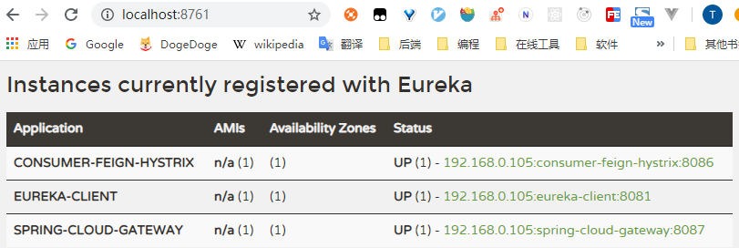
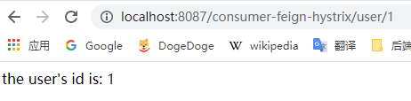
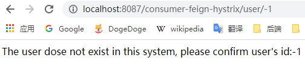

# Gateway入门实例

[toc]


## 推荐阅读

> - [SpringCloud gateway （史上最全）](https://www.cnblogs.com/crazymakercircle/p/11704077.html)
> - [springcloud(十五)：服务网关 Spring Cloud GateWay 入门](http://www.ityouknow.com/springcloud/2018/12/12/spring-cloud-gateway-start.html)


## 概述

> 
>


## 一、Gateway入门实例

### 1.父工程Pom.xml

```xml
<?xml version="1.0" encoding="UTF-8"?>
<project xmlns="http://maven.apache.org/POM/4.0.0"
         xmlns:xsi="http://www.w3.org/2001/XMLSchema-instance"
         xsi:schemaLocation="http://maven.apache.org/POM/4.0.0 http://maven.apache.org/xsd/maven-4.0.0.xsd">
    <parent>
        <artifactId>spring-cloud-sample</artifactId>
        <groupId>com.ray.study.sample</groupId>
        <version>1.0-SNAPSHOT</version>
    </parent>
    <modelVersion>4.0.0</modelVersion>

    <artifactId>sample-gateway</artifactId>
    <packaging>pom</packaging>
    <modules>
        <module>sample-spring-cloud-gateway</module>
    </modules>

    <properties>
        <project.build.sourceEncoding>UTF-8</project.build.sourceEncoding>
        <project.reporting.outputEncoding>UTF-8</project.reporting.outputEncoding>
        <java.version>1.8</java.version>
        <maven.compiler.source>${java.version}</maven.compiler.source>
        <maven.compiler.target>${java.version}</maven.compiler.target>
        <spring-boot.version>2.3.1.RELEASE</spring-boot.version>
        <spring-cloud.version>Hoxton.SR5</spring-cloud.version>
    </properties>

    <dependencies>
        <dependency>
            <groupId>org.projectlombok</groupId>
            <artifactId>lombok</artifactId>
            <optional>true</optional>
        </dependency>
    </dependencies>

    <dependencyManagement>
        <dependencies>
            <dependency>
                <groupId>org.springframework.boot</groupId>
                <artifactId>spring-boot-dependencies</artifactId>
                <version>${spring-boot.version}</version>
                <type>pom</type>
                <scope>import</scope>
            </dependency>
            <dependency>
                <groupId>org.springframework.cloud</groupId>
                <artifactId>spring-cloud-dependencies</artifactId>
                <version>${spring-cloud.version}</version>
                <type>pom</type>
                <scope>import</scope>
            </dependency>
        </dependencies>
    </dependencyManagement>

</project>
```


### 2.引入依赖

```xml
<?xml version="1.0" encoding="UTF-8"?>
<project xmlns="http://maven.apache.org/POM/4.0.0"
         xmlns:xsi="http://www.w3.org/2001/XMLSchema-instance"
         xsi:schemaLocation="http://maven.apache.org/POM/4.0.0 http://maven.apache.org/xsd/maven-4.0.0.xsd">
    <parent>
        <artifactId>sample-gateway</artifactId>
        <groupId>com.ray.study.sample</groupId>
        <version>1.0-SNAPSHOT</version>
    </parent>
    <modelVersion>4.0.0</modelVersion>

    <artifactId>sample-spring-cloud-gateway</artifactId>

    <dependencies>
        <!-- eureka-client -->
        <dependency>
            <groupId>org.springframework.cloud</groupId>
            <artifactId>spring-cloud-starter-netflix-eureka-client</artifactId>
        </dependency>

        <!-- gateway-->
        <dependency>
            <groupId>org.springframework.cloud</groupId>
            <artifactId>spring-cloud-starter-gateway</artifactId>
        </dependency>
    </dependencies>

    <build>
        <plugins>
            <plugin>
                <groupId>org.springframework.boot</groupId>
                <artifactId>spring-boot-maven-plugin</artifactId>
            </plugin>
        </plugins>
    </build>

</project>
```


### 3.修改配置

#### 3.1 启动类

```java
@SpringBootApplication
public class SpringCloudGatewayApplication {

    public static void main(String[] args) {
        SpringApplication.run(SpringCloudGatewayApplication.class, args);
    }
}
```


#### 3.2  application.yml

```yml
server:
  port: 8087 #运行端口号

spring:
  application:
    name: spring-cloud-gateway #指定服务名

## 配置gateway
  cloud:
    gateway:
      discovery:
        locator:
          enabled: true   # 是否与服务发现组件进行结合，通过serviceId转发到具体的服务实例。默认为false,若为true便开启基于服务发现的路由规则
          lowerCaseServiceId: true  # 当注册中心为Eureka时，设置为true表示开启小写的serviceId进行基于服务路由的转发

#配置eureka
eureka:
  client:
    register-with-eureka: true #注册到Eureka的注册中心
    fetch-registry: true #获取注册实例列表
    service-url:
      defaultZone: http://localhost:8761/eureka/ #指定注册中心地址
```


### 4.效果演示

（1）启动服务

> - 先分别启动  [SpringCloud_Discovery_01_Eureka入门实例](../../sample-discovery/doc/SpringCloud_Discovery_01_Eureka入门实例.md) 这一节中的 `eureka-server` 和 `eureka-client`
>
> - 然后启动 [SpringCloud_Hystrix_01_Hystrix入门实例](../../sample-hystrix/doc/SpringCloud_Hystrix_01_Hystrix入门实例.md) 这一节中的 `consumer-feign-hystrix`
>
> - 最后再启动本文的 `spring-cloud-gateway`


（2）访问 http://localhost:8761/ 可以看到这三个服务都注册到注册中心了




（3）通过网关访问 `consumer-feign-hystrix` 服务

> http://localhost:8087/consumer-feign-hystrix/user/1
>
> 
>
> http://localhost:8087/consumer-feign-hystrix/user/-1
>
> 


