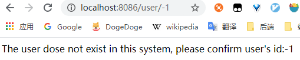

# Hystrix入门实例

[toc]


## 推荐阅读


## 概述

概述部分参考自：[防雪崩利器：熔断器 Hystrix 的原理与使用](https://segmentfault.com/a/1190000005988895)

### 1.雪崩效应

在微服务架构中通常会有多个服务层调用，底层服务提供者的不可用会导致其服务调用者不可用，并将不可用逐渐放大，形成级联故障，这种现象被称为雪崩效应。

> 例如，微服务调用链路： A -> B -> C -> D，服务D的不可用，回导致 C、B、A不可用，形成级联故障，造成雪崩效应


分布式系统中，造成服务不可用的原因通常包括：

> - 硬件故障
> - 网络连接缓慢造成的连接超时
> - 程序异常
> - 缓存击穿：一般发生在缓存应用重启，所有缓存被清空时，以及短时间内大量缓存失效时。大量的缓存不命中，使请求直击后端，造成服务提供者超负荷运行，引起服务不可用。
> - 用户大量请求


### 2.雪崩效应的应对方案

#### 2.1 流程控制

可使用Nginx或网关来进行流量控制，对流量大的应用进行分流和限流


#### 2.2 服务自动扩容

取决于硬件的限制，也可以使用第三方的云服务以达到扩容的效果。如果微服务构建得比较成熟，则可以通过容器的动态扩容来完成服务的扩容


#### 2.3 降级和资源隔离

**资源隔离**

> 主要是对调用服务的线程池进行隔离，监控一般要细致到线程级别，当发现某个线程占用资源过高时，进行有效的处理来解决性能瓶颈。

**降级**

> 在网络访问中，为了优化用户体验，遇到超时的情况，可以直接放弃本次请求，不等待结果的返回，进行降级处理：
>
> - （1）可以降级为直接返回用户默认数据 
> - （2）也可以降级为从另一个服务或者使用缓存中设置的默认数据。

**熔断**

> 熔断是指错误达到某个设定的阀值，或者请求数量超过阀值后，系统自动（或手动）阻止代码或服务的执行调用，从而达到系统整体保护的效果。当检测到系统可用时，需要恢复访问。


### 3.熔断器模式


熔断器模式定义了熔断器开关相互转换的逻辑：

> 服务的健康状况 = 请求失败数 / 请求总数. 
>
> 熔断器开关由关闭到打开的状态转换是通过当前服务健康状况和设定阈值比较决定的.
>
> 1. 当熔断器开关关闭时, 请求被允许通过熔断器. 如果当前健康状况高于设定阈值, 开关继续保持关闭. 如果当前健康状况低于设定阈值, 开关则切换为打开状态.
> 2. 当熔断器开关打开时, 请求被禁止通过.
> 3. 当熔断器开关处于打开状态, 经过一段时间后, 熔断器会自动进入半开状态, 这时熔断器只允许一个请求通过. 当该请求调用成功时, 熔断器恢复到关闭状态. 若该请求失败, 熔断器继续保持打开状态, 接下来的请求被禁止通过.
>
> 熔断器的开关能保证服务调用者在调用异常服务时, 快速返回结果, 避免大量的同步等待. 并且熔断器能在一段时间后继续侦测请求执行结果, 提供恢复服务调用的可能.


​	Hystrix是一个延迟和容错库，旨在隔离对远程系统、服务和第三方库的访问点，停止级联故障，并在复杂的分布式系统中实现恢复能力


## 一、Hystrix入门实例

### 1.父工程Pom.xml

```xml
<?xml version="1.0" encoding="UTF-8"?>
<project xmlns="http://maven.apache.org/POM/4.0.0"
         xmlns:xsi="http://www.w3.org/2001/XMLSchema-instance"
         xsi:schemaLocation="http://maven.apache.org/POM/4.0.0 http://maven.apache.org/xsd/maven-4.0.0.xsd">
    <parent>
        <artifactId>spring-cloud-sample</artifactId>
        <groupId>com.ray.study.sample</groupId>
        <version>1.0-SNAPSHOT</version>
    </parent>
    <modelVersion>4.0.0</modelVersion>

    <artifactId>sample-hystrix</artifactId>
    <packaging>pom</packaging>
    <modules>
        <module>sample-consumer-feign-hystrix</module>
    </modules>

    <properties>
        <project.build.sourceEncoding>UTF-8</project.build.sourceEncoding>
        <project.reporting.outputEncoding>UTF-8</project.reporting.outputEncoding>
        <java.version>1.8</java.version>
        <maven.compiler.source>${java.version}</maven.compiler.source>
        <maven.compiler.target>${java.version}</maven.compiler.target>
        <spring-cloud.version>Hoxton.SR5</spring-cloud.version>
    </properties>

    <dependencies>
        <dependency>
            <groupId>org.projectlombok</groupId>
            <artifactId>lombok</artifactId>
            <optional>true</optional>
        </dependency>
    </dependencies>

    <dependencyManagement>
        <dependencies>
            <dependency>
                <groupId>org.springframework.cloud</groupId>
                <artifactId>spring-cloud-dependencies</artifactId>
                <version>${spring-cloud.version}</version>
                <type>pom</type>
                <scope>import</scope>
            </dependency>
        </dependencies>
    </dependencyManagement>

</project>
```


### 2.引入依赖

```xml
<?xml version="1.0" encoding="UTF-8"?>
<project xmlns="http://maven.apache.org/POM/4.0.0"
         xmlns:xsi="http://www.w3.org/2001/XMLSchema-instance"
         xsi:schemaLocation="http://maven.apache.org/POM/4.0.0 http://maven.apache.org/xsd/maven-4.0.0.xsd">
    <parent>
        <artifactId>sample-hystrix</artifactId>
        <groupId>com.ray.study.sample</groupId>
        <version>1.0-SNAPSHOT</version>
    </parent>
    <modelVersion>4.0.0</modelVersion>

    <artifactId>sample-consumer-feign-hystrix</artifactId>

    <dependencies>
        <dependency>
            <groupId>org.springframework.boot</groupId>
            <artifactId>spring-boot-starter-web</artifactId>
        </dependency>

        <!-- eureka-client -->
        <dependency>
            <groupId>org.springframework.cloud</groupId>
            <artifactId>spring-cloud-starter-netflix-eureka-client</artifactId>
        </dependency>

        <!-- openfeign中包含了hystrix依赖-->
        <dependency>
            <groupId>org.springframework.cloud</groupId>
            <artifactId>spring-cloud-starter-openfeign</artifactId>
        </dependency>
    </dependencies>

</project>
```


### 3.修改配置

#### 3.1 启动类

在启动类上

> - 添加`@EnableDiscoveryClient`注解可启用服务发现
> - 添加`@EnableFeignClients`注解可启用 Feign（启用feign之后，再通过配置文件中的`feign.hystrix.enabled=true`来启用Hystrix）

```java
@EnableFeignClients
@EnableDiscoveryClient
@SpringBootApplication
public class ConsumerFeignHystrixApplication {

    public static void main(String[] args) {
        SpringApplication.run(ConsumerFeignHystrixApplication.class, args);
    }
}

```


#### 3.2  application.yml

```yml
server:
  port: 8086 #运行端口号
spring:
  application:
    name: consumer-feign-hystrix #指定服务名

#配置eureka
eureka:
  client:
    register-with-eureka: true #注册到Eureka的注册中心
    fetch-registry: true #获取注册实例列表
    service-url:
      defaultZone: http://localhost:8761/eureka/ #指定注册中心地址

#配置feign，连接超时及读取超时配置
feign:
  client:
    config:
      default:
        connectTimeout: 5000
        readTimeout: 5000
        loggerLevel: basic
  hystrix:
    enabled: true  # 在D版本之后，需要手动开启 feign的 hystrix
```


### 4.业务实现

#### 4.1 DTO

数据传输实体

```java
@Data
@AllArgsConstructor
@NoArgsConstructor
public class UserDto {

    private Long id;

    private String name;

    private Integer age;

    private Date creationDate;

    private Date lastUpdateDate;

}
```


#### 4.2 FeignClient

（1）编写一个FeignClient用于调用远程服务提供者提供的服务，并通过 `fallback`属性来指定降级类

```java
/**
 * UserClient
 *
 * 通过 @FeignClient 注解的 fallback 属性指定降级类
 *
 * @author ray
 * @date 2020/6/17
 */
@FeignClient(name = "eureka-client",path = "/user", fallback = UserClientFallback.class)
public interface UserClient {
    @GetMapping("/{id}")
    String getUser1(@PathVariable("id") Long id);

    @GetMapping("/get2")
    String getUser2(@RequestParam("name") String name, @RequestHeader("token") String token);

    @PostMapping("/get3")
    UserDto getUser3(@RequestBody UserDto dto);
}

```


（2）在降级类 UserClientFallback 中，通过覆写 FeignClient 相应接口来实现降级

```java
@Component
public class UserClientFallback implements UserClient {
    /**
     * 出错则调用该方法，返回友好错误
     * @param id
     * @return
     */
    @Override
    public String getUser1(Long id) {
        return "The user dose not exist in this system, please confirm user's id:"+id;
    }

    /**
     * 出错则调用该方法，返回友好错误
     * @return
     */
    @Override
    public String getUser2(String name, String token) {
        return "The user dose not exist in this system, please confirm user's name";
    }

    /**
     * 出错则调用该方法，返回友好错误
     * @return
     */
    @Override
    public UserDto getUser3(UserDto dto) {
        return null;
    }
}

```


#### 4.3 Controller

```java
@RestController
@RequestMapping("/user")
public class UserController {
    
    @Autowired
    UserClient userClient;

    /**
     * get 路径请求参数传递
     *  当 id<=0时抛出异常，被Hystrix降级处理
     */
    @GetMapping("/{id}")
    public String getUser1(@PathVariable("id") Long id){
        return userClient.getUser1(id);
    }

    /**
     * get 请求参数传递
     * @return
     */
    @GetMapping("/get2")
    public String getUser2() {
        return userClient.getUser2("张三", "271267312jhdsjfhdsjf3uwyruwe");
    }

    /**
     *  post 请求参数传递
     * @return
     */
    @PostMapping("/get3")
    public UserDto getUser3() {
        UserDto userDto =  new UserDto();
        userDto.setId(10001L);
        userDto.setName("张三");
        userDto.setAge(22);
        userDto.setCreationDate(new Date());
        return userClient.getUser3(userDto);
    }

}

```


### 5.效果演示

（1）启动  [SpringCloud_Discovery_01_Eureka入门实例](../../sample-discovery/doc/SpringCloud_Discovery_01_Eureka入门实例.md) 这一节中的 `eureka-server` 和`eureka-client`

（2）然后启动 `consumer-feign-hystrix`

（3）浏览器访问 http://localhost:8086/user/-1 ，`eureka-client` 服务已被降级




## 参考资料

> - [《重新定义Spring Cloud实战》(F版)](https://item.jd.com/12447280.html)
> - [纯洁的微笑__springcloud(四)：熔断器Hystrix](http://www.ityouknow.com/springcloud/2017/05/16/springcloud-hystrix.html)
> - [18 高并发之服务熔断与降级](https://www.jianshu.com/p/cda7c0366089)
> - [防雪崩利器：熔断器 Hystrix 的原理与使用](https://segmentfault.com/a/1190000005988895)


