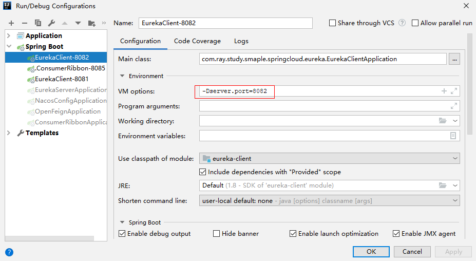
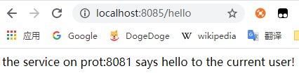
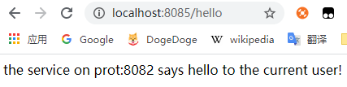

# Ribbon入门实例

[toc]


## 推荐阅读

### 1.Ribbon

> - [一起来学SpringCloud之-服务消费者（Ribbon）](https://blog.battcn.com/2017/07/26/springcloud/dalston/spring-cloud-ribbon/)
> - [SpringCloud Ribbon+RestTemplate 服务负载均衡调用](https://www.phpsong.com/3713.html)
> - [《重新定义Spring Cloud实战》](https://item.jd.com/12447280.html)

### 2.负载均衡

> - [瞬息之间__LB 负载均衡的层次结构](https://www.cnblogs.com/mindwind/p/5339657.html)
> - [常见的负载均衡算法](https://www.jianshu.com/p/1e56ace862e7)
> - [几种简单的负载均衡算法及其Java代码实现](https://www.cnblogs.com/xrq730/p/5154340.html)


## 概述

Ribbon 是一个客户端负载均衡器，它可以很好地控制HTTP和TCP客户端的行为，它具有如下功能：

> - 丰富的负载均衡策略
> - 重试机制
> - 支持多协议的异步和响应式模型
> - 容错
> - 缓存和批处理功能


关于服务端负载均衡与客户端负载均衡：

> - 负载均衡（LB，Load balancing）：即利用特定方式将流量分摊到多个操作单元上的一种手段，它对系统吞吐量和系统处理能力有着质的提升
>
> 
>
> - 对负载均衡的分类有：
>   - 从软硬件上分：
>     - **硬负载**：采用硬件设备（硬件负载均衡器）来提供负载均衡，代表有 F5负载均衡
>     - **软负载**：通过在服务器上安装的特定的负载均衡软件或是自带负载均衡模块完成对请求的分配派发，代表有Nginx负载均衡
>   - 从服务端和客户端上分
>     - **服务端负载均衡**：也叫集中式负载均衡，特指位于因特网和服务提供者之间，并负责把网络请求转发到各个提供者单位，这是Nginx 和 F5 就可以划为一类了
>     - **客户端负载均衡**：也叫进程内负载均衡，特指从一个实例库选取一个实例进行流量导入，在微服务的范畴内，实例库一般存储在 Eureka 、Consul、Zookeeper、etcd这样的注册中心，而此时的负载均衡器类似Ribbon的IPC(Inter-Process Communication，进程间通信)组件。服务提供方启动时，会将服务地址注册到服务注册中心，并通过心跳来维护，当服务消费者需要访问某个服务时，通过内置的LB组件定期向服务注册中心获取服务注册表，并以某种负载均衡策略选定一个目标服务地址，并发起请求。
>
> 
>
> - 常见的负载均衡算法，请参见：[五月的仓颉__几种简单的负载均衡算法及其Java代码实现](https://www.cnblogs.com/xrq730/p/5154340.html)：
>   - **轮询（Round Robin）**: 将请求按照顺序轮流的分配到服务器上，如 123，123，123
>   - **随机（Random）**： 通过系统随机函数，根据后端服务器列表的大小值来随机选择其中一台进行访问
>   - **源地址哈希（Hash）**：源地址哈希的思想是获取客户端访问的IP地址值，通过哈希函数计算得到一个数值，用该数值对服务器列表的大小进行取模运算，得到的结果便是要访问的服务器的序号。
>   - **加权轮询（Weight Round Robin）**: 不同的服务器可能机器配置和当前系统的负载并不相同，因此它们的抗压能力也不尽相同，给配置高、负载低的机器配置更高的权重，让其处理更多的请求，而低配置、高负载的机器，则给其分配较低的权重，降低其系统负载
>   - **加权随机（Weight Random）**: 与加权轮询法类似，加权随机法也是根据后端服务器不同的配置和负载情况来配置不同的权重。不同的是，它是按照权重来随机选择服务器的，而不是顺序。
>   - **最小连接数（Least Connections）**:


## 一、Feign入门实例

### 1.父工程Pom.xml

```xml
<?xml version="1.0" encoding="UTF-8"?>
<project xmlns="http://maven.apache.org/POM/4.0.0"
         xmlns:xsi="http://www.w3.org/2001/XMLSchema-instance"
         xsi:schemaLocation="http://maven.apache.org/POM/4.0.0 http://maven.apache.org/xsd/maven-4.0.0.xsd">
    <parent>
        <artifactId>spring-cloud-sample</artifactId>
        <groupId>com.ray.study.sample</groupId>
        <version>1.0-SNAPSHOT</version>
    </parent>
    <modelVersion>4.0.0</modelVersion>

    <artifactId>sample-ribbon</artifactId>
    <packaging>pom</packaging>
    <modules>
        <module>sample-consumer-ribbon</module>
    </modules>

    <properties>
        <project.build.sourceEncoding>UTF-8</project.build.sourceEncoding>
        <project.reporting.outputEncoding>UTF-8</project.reporting.outputEncoding>
        <java.version>1.8</java.version>
        <maven.compiler.source>${java.version}</maven.compiler.source>
        <maven.compiler.target>${java.version}</maven.compiler.target>
        <spring-cloud.version>Hoxton.SR5</spring-cloud.version>
    </properties>

    <dependencies>
        <dependency>
            <groupId>org.projectlombok</groupId>
            <artifactId>lombok</artifactId>
            <optional>true</optional>
        </dependency>
    </dependencies>

    <dependencyManagement>
        <dependencies>
            <dependency>
                <groupId>org.springframework.cloud</groupId>
                <artifactId>spring-cloud-dependencies</artifactId>
                <version>${spring-cloud.version}</version>
                <type>pom</type>
                <scope>import</scope>
            </dependency>
        </dependencies>
    </dependencyManagement>

</project>
```


### 2.引入依赖

```xml
<?xml version="1.0" encoding="UTF-8"?>
<project xmlns="http://maven.apache.org/POM/4.0.0"
         xmlns:xsi="http://www.w3.org/2001/XMLSchema-instance"
         xsi:schemaLocation="http://maven.apache.org/POM/4.0.0 http://maven.apache.org/xsd/maven-4.0.0.xsd">
    <parent>
        <artifactId>sample-ribbon</artifactId>
        <groupId>com.ray.study.sample</groupId>
        <version>1.0-SNAPSHOT</version>
    </parent>
    <modelVersion>4.0.0</modelVersion>

    <artifactId>sample-consumer-ribbon</artifactId>

    <dependencies>
        <dependency>
            <groupId>org.springframework.boot</groupId>
            <artifactId>spring-boot-starter-web</artifactId>
        </dependency>

        <!-- eureka-client -->
        <dependency>
            <groupId>org.springframework.cloud</groupId>
            <artifactId>spring-cloud-starter-netflix-eureka-client</artifactId>
        </dependency>

        <!-- ribbon -->
        <dependency>
            <groupId>org.springframework.cloud</groupId>
            <artifactId>spring-cloud-starter-netflix-ribbon</artifactId>
        </dependency>
    </dependencies>

</project>
```


### 3.修改配置

#### 3.1 启动类

在启动类上启用服务发现

```java
@SpringBootApplication
@EnableDiscoveryClient
public class ConsumerRibbonApplication {

    public static void main(String[] args) {
        SpringApplication.run(ConsumerRibbonApplication.class, args);
    }

}

```


#### 3.2 RibbonConfig

增加配置类RibbonConfig，通过添加 @LoadBalanced 注解 声明该 restTemplate 用于负载均衡

```java
@Configuration
public class RibbonConfig {

    /**
     *  通过添加 @LoadBalanced 注解 声明该 restTemplate 用于负载均衡
     * @return
     */
    @Bean
    @LoadBalanced
    public RestTemplate restTemplate(){
        return new RestTemplate();
    }

    /**
     * 设置Ribbon采取的负载均衡算法
     * @return
     */
    //	@Bean
    //	public IRule ribbonRule(){
    //		// 随机算法
    //		return new RandomRule();
    //	}

}
```


#### 3.3  application.yml

```yml
server:
  port: 8085 #运行端口号
spring:
  application:
    name: consumer-ribbon #指定服务名

#配置eureka
eureka:
  client:
    register-with-eureka: true #注册到Eureka的注册中心
    fetch-registry: true #获取注册实例列表
    service-url:
      defaultZone: http://localhost:8761/eureka/ #指定注册中心地址

```


### 5.业务实现

这里我们写一个简单的controller，来调用  [SpringCloud_Discovery_01_Eureka入门实例](../../sample-discovery/doc/SpringCloud_Discovery_01_Eureka入门实例.md) 这一节中创建的  eureka-client 服务

```java
package com.ray.study.springcloud02consumerribbon.controller;

import lombok.extern.slf4j.Slf4j;
import org.springframework.beans.factory.annotation.Autowired;
import org.springframework.web.bind.annotation.GetMapping;
import org.springframework.web.bind.annotation.RestController;
import org.springframework.web.client.RestTemplate;

/**
 * description
 *
 * @author shira 2019/05/22 17:01
 */
@RestController
@Slf4j
public class HelloRibbonController {

	@Autowired
	RestTemplate restTemplate;

	@GetMapping("/hello")
	public String sayHello(){
		String result = restTemplate.getForObject("http://eureka-client/hello",String.class);
		log.info(result);
		return result;
	}

}

```


### 6.效果演示

（1）启动  [SpringCloud_Discovery_01_Eureka入门实例](../../sample-discovery/doc/SpringCloud_Discovery_01_Eureka入门实例.md) 这一节中的 `eureka-server` 

（2）启动  [SpringCloud_Discovery_01_Eureka入门实例](../../sample-discovery/doc/SpringCloud_Discovery_01_Eureka入门实例.md) 这一节中的 `eureka-client`，这里我们启动三个实例，分别是 8081、8082、8083

> 启动时可通过指定命令行参数 `-Dserver.port=8082` 来指定启动的端口，如下图：
>
> 


（3）然后启动 `consumer-ribbon`

（3）浏览器访问 http://localhost:8085/hello ，发现成功通过 RestTemplate 调用了  `eureka-client`服务的API，并且做了负载均衡。

多次调用显示， ip 被轮询了







