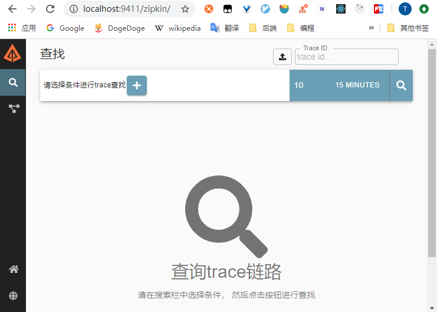

# 使用Sleuth+Zipkin实现分布式链路追踪入门实例

[toc]


## 推荐阅读

> - [Spring Cloud（十二）：分布式链路跟踪 Sleuth 与 Zipkin【Finchley 版】](https://windmt.com/2018/04/24/spring-cloud-12-sleuth-zipkin/)
> - [springcloud系列七 整合slueth,zipkin 分布式链路调用系统:](https://www.cnblogs.com/xiufengchen/p/10333083.html)
> - [Spring Cloud Sleuth：分布式请求链路跟踪](https://juejin.im/post/5dadb4d36fb9a04e02409a7d)


## 概述

> 
>


## 一、Sleuth+ZipKin入门实例

### 1.部署ZipKin Server

zipkin官网提供了[几种部署方案](https://zipkin.io/pages/quickstart.html)，这里我们选择下载可执行jar的方式：

（1）下载 [zipkin.jar](https://search.maven.org/remote_content?g=io.zipkin&a=zipkin-server&v=LATEST&c=exec)

（2）然后运行如下命令启动 zipkin server

```bash
java -jar zipkin-server-2.21.4-exec.jar
```


然后浏览器访问 http://localhost:9411/zipkin/



 


### 2.父工程Pom.xml

接下来我们将创建一个服务提供者（ `sample-tracing-sleuth-zipkin-provider`）、一个服务消费者（`sample-tracing-sleuth-zipkin-consumer`）来演示Sleuth搭配Zipkin的分布式链路追踪示例，其实服务提供者和消费者的依赖和配置基本相同。

不过首先我们来创建父工程，Pom如下：

```xml
<?xml version="1.0" encoding="UTF-8"?>
<project xmlns="http://maven.apache.org/POM/4.0.0"
         xmlns:xsi="http://www.w3.org/2001/XMLSchema-instance"
         xsi:schemaLocation="http://maven.apache.org/POM/4.0.0 http://maven.apache.org/xsd/maven-4.0.0.xsd">
    <parent>
        <artifactId>sample-tracing</artifactId>
        <groupId>com.ray.study.sample</groupId>
        <version>1.0-SNAPSHOT</version>
    </parent>
    <modelVersion>4.0.0</modelVersion>

    <artifactId>sample-tracing-sleuth-zipkin</artifactId>
    <packaging>pom</packaging>
    <modules>
        <module>sample-tracing-sleuth-zipkin-provider</module>
        <module>sample-tracing-sleuth-zipkin-consumer</module>
    </modules>

    <properties>
        <project.build.sourceEncoding>UTF-8</project.build.sourceEncoding>
        <project.reporting.outputEncoding>UTF-8</project.reporting.outputEncoding>
        <java.version>1.8</java.version>
        <maven.compiler.source>${java.version}</maven.compiler.source>
        <maven.compiler.target>${java.version}</maven.compiler.target>
        <spring-boot.version>2.3.1.RELEASE</spring-boot.version>
        <spring-cloud.version>Hoxton.SR5</spring-cloud.version>
    </properties>

    <dependencies>
        <dependency>
            <groupId>org.projectlombok</groupId>
            <artifactId>lombok</artifactId>
            <optional>true</optional>
        </dependency>
    </dependencies>

    <dependencyManagement>
        <dependencies>
            <dependency>
                <groupId>org.springframework.boot</groupId>
                <artifactId>spring-boot-dependencies</artifactId>
                <version>${spring-boot.version}</version>
                <type>pom</type>
                <scope>import</scope>
            </dependency>
            <dependency>
                <groupId>org.springframework.cloud</groupId>
                <artifactId>spring-cloud-dependencies</artifactId>
                <version>${spring-cloud.version}</version>
                <type>pom</type>
                <scope>import</scope>
            </dependency>
        </dependencies>
    </dependencyManagement>

</project>
```


### 3.服务提供者

#### 3.1 引入依赖

```xml
<?xml version="1.0" encoding="UTF-8"?>
<project xmlns="http://maven.apache.org/POM/4.0.0"
         xmlns:xsi="http://www.w3.org/2001/XMLSchema-instance"
         xsi:schemaLocation="http://maven.apache.org/POM/4.0.0 http://maven.apache.org/xsd/maven-4.0.0.xsd">
    <parent>
        <artifactId>sample-tracing-sleuth-zipkin</artifactId>
        <groupId>com.ray.study.sample</groupId>
        <version>1.0-SNAPSHOT</version>
    </parent>
    <modelVersion>4.0.0</modelVersion>

    <artifactId>sample-tracing-sleuth-zipkin-provider</artifactId>

    <dependencies>
        <dependency>
            <groupId>org.springframework.boot</groupId>
            <artifactId>spring-boot-starter-web</artifactId>
        </dependency>
        <!-- eureka-client -->
        <dependency>
            <groupId>org.springframework.cloud</groupId>
            <artifactId>spring-cloud-starter-netflix-eureka-client</artifactId>
        </dependency>
        <!-- openfeign -->
        <dependency>
            <groupId>org.springframework.cloud</groupId>
            <artifactId>spring-cloud-starter-openfeign</artifactId>
        </dependency>
        <!-- zipkin 中默认包含了 sleuth -->
        <dependency>
            <groupId>org.springframework.cloud</groupId>
            <artifactId>spring-cloud-starter-zipkin</artifactId>
        </dependency>
    </dependencies>

    <build>
        <plugins>
            <plugin>
                <groupId>org.springframework.boot</groupId>
                <artifactId>spring-boot-maven-plugin</artifactId>
            </plugin>
        </plugins>
    </build>
</project>
```


#### 3.2 修改配置

##### 3.2.1 启动类

```java
@EnableDiscoveryClient
@SpringBootApplication
public class SleuthZipkinProviderApplication {
    public static void main(String[] args) {
        SpringApplication.run(SleuthZipkinProviderApplication.class,args);
    }
}

```


##### 3.2.1  application.yml

```yml
server:
  port: 8088 #运行端口号

spring:
  application:
    name: sleuth-zipkin-provider #指定服务名
  #配置 sleuth 和 zipkin
  sleuth:
    web:
      client:
        enabled: true
    sampler:
      probability: 1.0 # 将采样比例设置为 1.0，也就是全部都需要。默认是 0.1
    zipkin:
      base-url: http://localhost:9411/ # 指定了 Zipkin 服务器的地址

#配置eureka
eureka:
  client:
    register-with-eureka: true #注册到Eureka的注册中心
    fetch-registry: true #获取注册实例列表
    service-url:
      defaultZone: http://localhost:8761/eureka/ #指定注册中心地址
```


#### 3.3 业务实现

```java
@RestController
@Slf4j
public class SleuthHelloController {

    @GetMapping("/sayHello")
    public String hello(String name){
        log.info("Service Provider recived! param:{}", name);
        return  "hello, "+name;
    }

}
```


### 4.服务消费者

#### 4.1 引入依赖

```xml
<?xml version="1.0" encoding="UTF-8"?>
<project xmlns="http://maven.apache.org/POM/4.0.0"
         xmlns:xsi="http://www.w3.org/2001/XMLSchema-instance"
         xsi:schemaLocation="http://maven.apache.org/POM/4.0.0 http://maven.apache.org/xsd/maven-4.0.0.xsd">
    <parent>
        <artifactId>sample-tracing-sleuth-zipkin</artifactId>
        <groupId>com.ray.study.sample</groupId>
        <version>1.0-SNAPSHOT</version>
    </parent>
    <modelVersion>4.0.0</modelVersion>

    <artifactId>sample-tracing-sleuth-consumer</artifactId>

    <dependencies>
        <dependency>
            <groupId>org.springframework.boot</groupId>
            <artifactId>spring-boot-starter-web</artifactId>
        </dependency>
        <!-- eureka-client -->
        <dependency>
            <groupId>org.springframework.cloud</groupId>
            <artifactId>spring-cloud-starter-netflix-eureka-client</artifactId>
        </dependency>
        <!-- openfeign -->
        <dependency>
            <groupId>org.springframework.cloud</groupId>
            <artifactId>spring-cloud-starter-openfeign</artifactId>
        </dependency>
        <!-- zipkin 中默认包含了 sleuth -->
        <dependency>
            <groupId>org.springframework.cloud</groupId>
            <artifactId>spring-cloud-starter-zipkin</artifactId>
        </dependency>
    </dependencies>

    <build>
        <plugins>
            <plugin>
                <groupId>org.springframework.boot</groupId>
                <artifactId>spring-boot-maven-plugin</artifactId>
            </plugin>
        </plugins>
    </build>
</project>
```


#### 4.2 修改配置

##### 4.2.1 启动类

```java
@SpringBootApplication
@EnableFeignClients
public class SleuthZipkinConsumerApplication {

    @Autowired
    BeanFactory beanFactory;

    public static void main(String[] args) {
        SpringApplication.run(SleuthZipkinConsumerApplication.class,args);
    }

    @Bean
    public ExecutorService executorService(){
        // 简单起见, 我们注册固定大小的线程池
        ExecutorService executorService =  Executors.newFixedThreadPool(2);
        return new TraceableExecutorService(this.beanFactory, executorService);
    }
}

```


##### 4.2.1  application.yml

```yml
server:
  port: 8089 #运行端口号

spring:
  application:
    name: sleuth-zipkin-consumer #指定服务名
  #配置 sleuth 和 zipkin
  sleuth:
    web:
      client:
        enabled: true
    sampler:
      probability: 1.0 # 将采样比例设置为 1.0，也就是全部都需要。默认是 0.1
    zipkin:
      base-url: http://localhost:9411/ # 指定了 Zipkin 服务器的地址

#配置eureka
eureka:
  client:
    register-with-eureka: true #注册到Eureka的注册中心
    fetch-registry: true #获取注册实例列表
    service-url:
      defaultZone: http://localhost:8761/eureka/ #指定注册中心地址

#配置feign，连接超时及读取超时配置
feign:
  client:
    config:
      default:
        connectTimeout: 5000
        readTimeout: 5000
        loggerLevel: basic
  hystrix:
    enabled: true  # 在D版本之后，需要手动开启 feign的 hystrix
```


#### 4.3 业务实现

##### 4.3.1 FeignClient

```java
@FeignClient(name = "sleuth-zipkin-provider",path = "/")
public interface SleuthHelloClient {

    @RequestMapping("/sayHello")
    String sayHello(@RequestParam("name") String name);

}

```


##### 4.3.2 Controller

```java
@RestController
@Slf4j
public class SleuthHelloController {

    @Autowired
    SleuthHelloClient sleuthHelloClient;

    @Autowired
    private ExecutorService executorService;

    @GetMapping("/hello")
    public String hello(String name){
        log.info("FeignClient start to send! param:{}", name);
        String result = sleuthHelloClient.sayHello(name);
        log.info("FeignClient received! result:{}", result);
        return result;
    }

    @GetMapping("/helloByNewThread")
    public String helloByNewThread(String name) throws ExecutionException, InterruptedException {
        log.info("FeignClient start to send by new thread, param: {}",name);

        Future future = executorService.submit(() -> {
            log.info("FeignClient start to send, in sub thread, param: {}",name);
            String result = sleuthHelloClient.sayHello(name);
            return result;
        });
        String result = (String) future.get();
        log.info("FeignClient received, return main thread, result: {}",result);
        return result;
    }

}
```


### 5.效果演示

（1）启动服务

> - 首先确保已经启动了 Zipkin Server，如果没有请回到 1.部署ZipKin Server 这部分
>- 然后启动  [SpringCloud_Discovery_01_Eureka入门实例](../../sample-discovery/doc/SpringCloud_Discovery_01_Eureka入门实例.md) 这一节中的 `eureka-server` 
> - 接着启动本文的 服务提供者和消费者： sleuth-zipkin-provider、sleuth-zipkin-consumer


（2）访问 http://localhost:8089/hello?name=tom，成功得到返回结果


（3）然后访问 zipkin-server 来查看日志

> http://localhost:9411/zipkin/ 

点击查询，发现有一条记录


点击记录，即可看到服务的调用链路，以及耗时等信息


还可以看到服务的依赖关系


